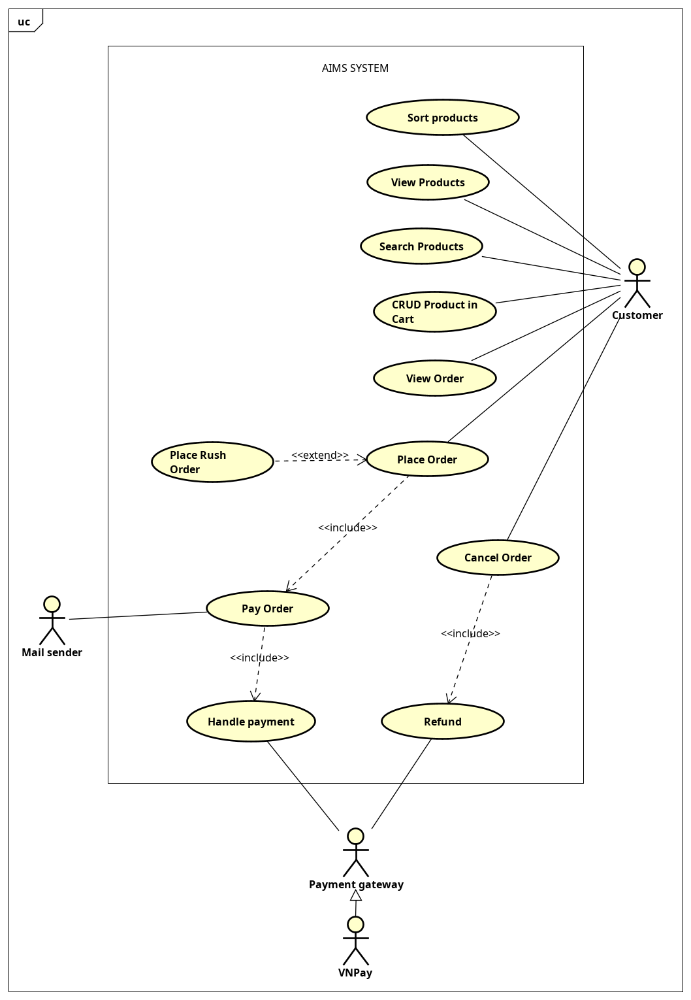

# TKXDPM.VP.20241.06

<p align="center">
  
</p>

## Team Members and Responsibilities

### Lê Hoàng Long - Product Management

- Sort, view, search products
- CRUD Product in Cart

### Trần Thành Nam - Cart & Order Management

- Place Order
- Place Rush Order

### Trần Nhật Minh - Order Processing

- View Order
- Cancel Order
- Refund

### Vũ Việt Anh (Team Leader) - Payment Integration

- Pay Order
- Handle payment (VNPay integration)

## Technical Stack

- Java
- JavaFX for UI
- SQLite for database
- Maven for dependency management

## Prerequisites

- Java Development Kit (JDK)
- SQLite3
- Maven

## UseCase

<p align="center">
  
</p>

## Installation & Running

1. Clone the repository:

```bash
git clone https://github.com/your-username/TKXDPM.VP.20241.06.git
```

2. Install dependencies:

```bash
cd AIMS
mvn install
```

3. Run the application

```bash
mvn javafx:run
```

<u>**Note**</u>: A simpler way to run this project

1. Open the project in **IntelliJ IDEA**.
2. Locate and open the `App` file.
3. Right-click on the file and select **Run 'App'**.
